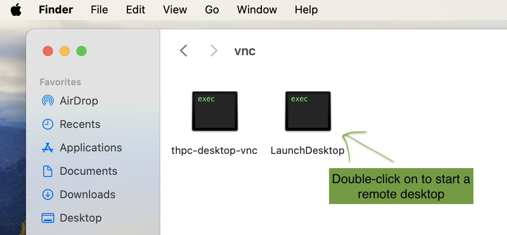
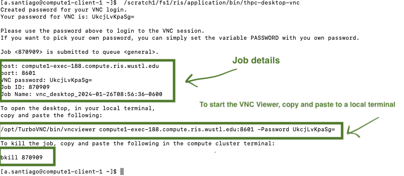
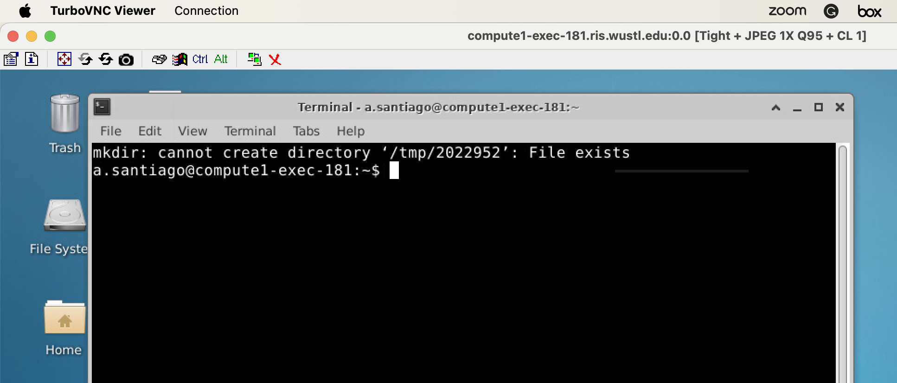

[Compute1](../Compute1.md)

# Local VNC Viewer

- [Pre-requisites](#pre-requisites)
- [Connecting through NoVNC](#connecting-through-novnc)

- This guide provides a step-by-step instructions on how you can connect to RIS compute serivces through local PC/Laptop through GUI.
- This guide details step-by-step instructions on connecting to RIS compute services via VNC GUI through a local Linux/MacOS computer. Windows platform is currently not supported.

# Pre-requisites

## Connecting to WashU Network

- If you are off campus, you will need to use a VPN to access compute1.
- Instructions for accessing the WashU VPNs can be found [here.](https://it.wustl.edu/items/connect/)
- If you run into issues using the VPN, you will need to follow the directions in the previous link to contact WashU IT proper.

## Compute/Storage Allocation

- User must have a compute/storage allocation.
- If you do not have one, You can request [here.](https://washu.atlassian.net/servicedesk/customer/portal/2/group/6/create/53)

## Install TurboVNC Viewer

- Install [TurboVNC Viewer](https://www.turbovnc.org/) on the local computer
- On MacOS, run:

```
brew install --cask turbovnc-viewer
```

- Validate that installation is successful. There should be an application under Finder -> Applications.
- Install [expect](https://formulae.brew.sh/formula/expect), on local computer run:

```
brew install expect
```

- Validate that installation is successful.; run:

```
which expect
/usr/bin/expect ## output
```

- (Optional) Add vncviewer in the PATH variable, Open Terminal then run:

```
echo 'export PATH="/opt/TurboVNC/bin:$PATH"' >> ~/.zshrc

source ~/.zshrc
```

## Add SSH Private-Public Key Pair

- If you do not have SSH private-public key pair already setup. Please refer our guide [SSH Private-Public Key Pair](https://washu.atlassian.net/wiki/spaces/RUD/pages/1705869414/SSH+Private-Public+Key+Pair)

# Connecting through NoVNC

- User should be either connected to campus network or WashU VPN.
- Download [LaunchDesktop.zip](https://wustl.box.com/s/8w6303e08bdv6ff4b8jz0n2h0u6oxtno) to a desired location, preferably, on the Desktop. (note: WashU login required)
- Unzip `LaunchDesktop.zip` or just double-click on the zip file.
- This will output an executable file `LaunchDesktop`.



- Now open the LaunchDesktop file with any text editor and enter your WashU Key in the first line as below example:

```
# Set a WASHU key
set WUSTLKEY "WASHU_KEY"
```

> [!IMPORTANT]
> This viewer was created before the change to WashU Key and so the variable name that should be used is still WUSTLKEY.

- Double-click the executable. It will open a terminal session, connect to RIS platform, submits a job and output a command to connect VNC viewer. (Refer example screenshot below)



- Now, copy the command that starts with `/opt/TurboVNC/…` in another instance of terminal and run it.


- You shall be able to now access desktop GUI on the compute node.


